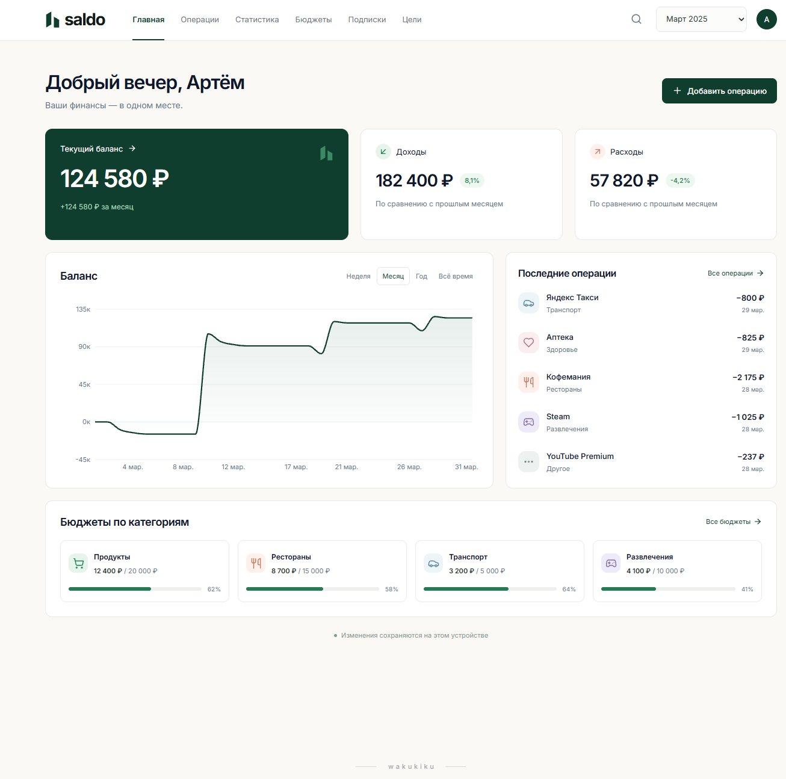
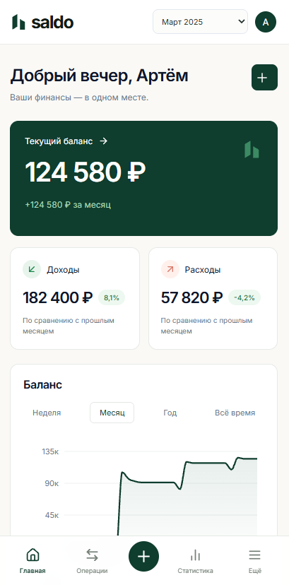

# SALDO

SALDO — адаптивное веб-приложение для учёта личных финансов.

Я делал этот проект как полноценный интерактивный интерфейс, а не просто статичный макет. В приложении можно работать с операциями, бюджетами, подписками и финансовыми целями, а основные показатели автоматически пересчитываются в зависимости от данных выбранного периода.

## Демо

[Открыть сайт](https://saldo-taupe.vercel.app/)

## Скриншоты

### Десктоп



### Мобильная версия



## Что реализовано

- главная страница со сводкой по балансу, доходам и расходам;
- добавление, редактирование и удаление операций;
- статистика по выбранному периоду;
- графики доходов и расходов;
- бюджеты по категориям;
- отображение прогресса по расходам;
- учёт подписок;
- финансовые цели;
- переключение между месяцами;
- сохранение данных между сессиями;
- адаптивная версия для десктопа и мобильных устройств;
- ленивая загрузка страниц через `React.lazy`.

## Стек

- React 19
- TypeScript
- Vite
- React Router
- Zustand
- Recharts
- Lucide React
- Fontsource / Inter

## Структура проекта

```text
src/
├── main.tsx      # приложение, роутинг и основная навигация
├── pages.tsx     # страницы приложения и графики
├── editors.tsx   # формы и панели редактирования
├── store.ts      # состояние приложения и работа с данными
├── ui.tsx        # переиспользуемые UI-компоненты
└── styles.css    # стили приложения
```
